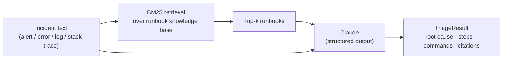

# Incident Triage Assistant

An AI on-call assistant. Paste an alert, error, log excerpt, or stack trace; it
retrieves the most relevant runbooks from a knowledge base and asks Claude to
return a **grounded, structured triage**: probable root cause, ordered
remediation steps, the exact commands to run, and when to escalate.

It is a retrieval-augmented generation (RAG) pipeline built on the Anthropic
Claude API, with the reasoning constrained to a typed schema so the output is
always machine-usable.

**Stack:** Python · Claude API (Opus 5, structured outputs, adaptive thinking) · pure-Python BM25 retrieval · Streamlit · pytest

---

## How it works



1. **Retrieve.** A dependency-free BM25 index ranks the markdown runbooks against
   the incident text. Error output and runbooks share a lot of literal tokens
   (error strings, tool names, exit codes), so lexical ranking is a strong,
   transparent first stage.
2. **Reason.** The top-k runbooks plus the incident are sent to Claude with a
   system prompt that tells it to stay grounded in the runbooks, never invent
   commands, and lower its confidence when the runbooks do not cover the case.
3. **Return.** The Messages API structured-output feature constrains the response
   to a Pydantic schema (`TriageResult`), so every triage is valid JSON with the
   same fields, ready to render in a UI, a ticket, or a chat bot.

## Demo

### CLI

```console
$ python cli.py --retrieval-only "OOMKilled exit code 137, container terminated, memory limit exceeded"
Retrieved runbooks:
  [ 16.03]  Kubernetes Pod OOMKilled  (kubernetes-pod-oomkilled)
  [  5.53]  Kubernetes CrashLoopBackOff  (kubernetes-crashloopbackoff)
  [  1.86]  Database Connection Pool Exhaustion  (database-connection-pool-exhaustion)
```

With an API key set, a full triage (illustrative shape):

```text
====================================================================
SUMMARY     The container is being OOMKilled because its memory limit is below its working set.
SEVERITY    HIGH      CONFIDENCE  HIGH
====================================================================

ROOT CAUSE
  Exit code 137 with Reason: OOMKilled means the kernel killed the container for
  exceeding resources.limits.memory. Under load the working set crosses the limit.

REMEDIATION STEPS
  1. Confirm the OOM kill and exit code with `kubectl describe pod`.
  2. Compare live usage to the configured limit with `kubectl top pod`.
  3. Raise resources.limits.memory to the observed peak plus headroom and roll out.
  ...

COMMANDS
  $ kubectl describe pod <pod>
  $ kubectl top pod <pod> --containers

GROUNDED IN
  - Kubernetes Pod OOMKilled
```

### Web UI

```bash
streamlit run app.py
```

A single-page Streamlit app: paste an incident (or load a sample), preview the
retrieved runbooks, and get the triage rendered with severity/confidence badges
and the runbooks it was grounded in.

## Quickstart

```bash
git clone https://github.com/85ip9gh/incident-triage-assistant.git
cd incident-triage-assistant

python -m venv .venv && source .venv/bin/activate   # Windows: .venv\Scripts\activate
pip install -r requirements.txt

cp .env.example .env        # then add your ANTHROPIC_API_KEY

# CLI
python cli.py "HikariPool-1 - Connection is not available, timed out after 30000ms"
kubectl logs mypod --previous | python cli.py

# Web UI
streamlit run app.py
```

The knowledge base loads and **retrieval works with no API key** (use
`--retrieval-only`, or "Preview retrieval" in the UI). Producing a triage needs
`ANTHROPIC_API_KEY`.

### Configuration

| Variable            | Default           | Purpose                                             |
| ------------------- | ----------------- | --------------------------------------------------- |
| `ANTHROPIC_API_KEY` | –                 | Required to generate a triage.                      |
| `TRIAGE_MODEL`      | `claude-opus-5`   | Any Claude model; e.g. `claude-sonnet-5` to cut cost. |
| `TRIAGE_FALLBACK_MODEL` | `claude-opus-4-8` | Model retried on a policy refusal. Empty to disable. |
| `TRIAGE_TOP_K`      | `3`               | Number of runbooks fed to the model.                |
| `TRIAGE_MAX_TOKENS` | `8192`            | Output budget (covers adaptive thinking + answer).  |

## Evaluation

The retrieval stage is measured against a labelled set of incidents
(`evals/cases.json`), each mapped to the runbook that should be retrieved. The
retrieval eval runs **offline, without an API key**:

```console
$ python evals/run_evals.py
Retrieval eval  (top_k=3, 10 cases)
  ...
  hit@3: 10/10 (100%)    MRR: 1.000
```

`hit@3 = 10/10` and `MRR = 1.000` means the correct runbook is not just in the
top 3, it is ranked **first** for every case. Run `python evals/run_evals.py
--full` to additionally score the end-to-end LLM triage (needs a key): it checks
that the expected runbook is cited and the severity matches.

## Design decisions

- **Grounding over hallucination.** The model is instructed to base its answer on
  the retrieved runbooks, cite them, and drop its confidence when they do not
  match. Better to describe a step in words than fabricate a precise command.
- **Structured output.** Constraining the response to the `TriageResult` schema
  removes brittle text parsing and makes the assistant a drop-in component for a
  ticketing system, Slack bot, or dashboard.
- **Pure-Python BM25.** No vector database, no embedding API key, no heavy
  dependencies. Retrieval is transparent, fast, and fully unit-tested offline.
  The `Retriever` protocol is a clean seam: swap in a semantic/embedding
  retriever without touching the engine.
- **Model-agnostic.** Defaults to Claude Opus 5 for the strongest reasoning;
  one environment variable switches to a cheaper model for high-volume triage.
- **Refusal-aware.** Claude Opus 5 runs elevated cybersecurity safeguards, and
  incident text describing malware, intrusion, or exploit activity can trip them.
  A refusal is an HTTP 200 with `stop_reason="refusal"`, not an error, so the
  engine checks the stop reason before reading content and raises a distinct
  `TriageRefusedError` rather than reporting a parse failure. A server-side
  fallback retries the request on `claude-opus-4-8` first, so a refusal only
  reaches the caller once the whole chain has declined.
- **Adaptive thinking.** The engine enables adaptive thinking so Claude decides
  how much to reason per incident.

## Project layout

```
triage/
  config.py          # settings from env vars
  models.py          # TriageResult (Pydantic schema for structured output)
  knowledge_base.py  # runbook loading + BM25 retriever (Retriever protocol)
  engine.py          # RAG pipeline: retrieve -> Claude -> TriageResponse
runbooks/            # the knowledge base (markdown, one failure mode per file)
evals/               # labelled cases + retrieval/LLM eval runner
tests/               # offline pytest suite for retrieval
cli.py               # command-line entry point
app.py               # Streamlit UI
```

## Tests

```bash
pip install -r requirements-dev.txt
pytest        # 16 offline tests, no API key required
```

## Notes and limitations

- The bundled runbooks cover common infrastructure failure modes and are meant as
  a starting point. Drop your own `*.md` runbooks into `runbooks/` and they are
  indexed automatically.
- Retrieval is lexical (BM25). For paraphrased incidents with little token
  overlap, add a semantic retriever behind the existing `Retriever` protocol.
- This is a decision-support tool. Review its output before running commands in
  production.

## License

MIT — see [LICENSE](LICENSE).
